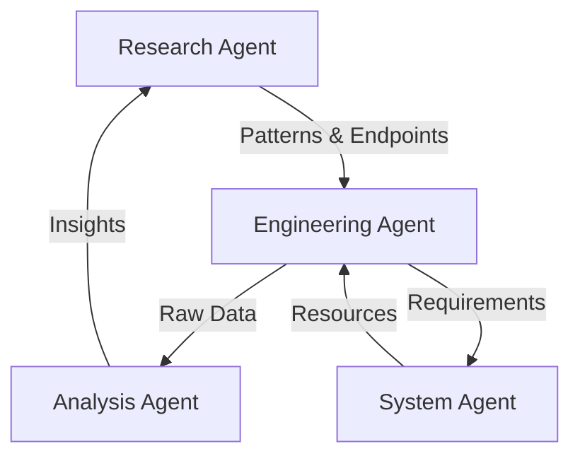

# Distributed Data Collection System

## Overview
Our system uses multiple specialized agents that work together to collect and analyze real-time numerical data streams.

## Agent Types

### 1. Research Agent
- **Purpose**: Discover and document data patterns
- **Key Tasks**:
  - Analyze data structures
  - Document WebSocket endpoints
  - Track connection stability
  - Report new patterns

### 2. Engineering Agent
- **Purpose**: Implement and maintain collection systems
- **Key Tasks**:
  - Network optimization
  - Connection management
  - Stability implementation
  - Error recovery

### 3. Analysis Agent
- **Purpose**: Process and analyze data streams
- **Key Tasks**:
  - Pattern recognition
  - Data validation
  - Statistical analysis
  - Trend prediction

### 4. System Agent
- **Purpose**: Manage system resources and configuration
- **Key Tasks**:
  - WSL management
  - Docker orchestration
  - Network configuration
  - Resource optimization

## Agent Interactions



## Communication Protocol

### Message Format
```json
{
    "from_agent": "research",
    "to_agent": "engineering",
    "message_type": "pattern_discovery",
    "priority": "high",
    "data": {
        "pattern_type": "websocket",
        "details": {},
        "timestamp": "ISO-8601"
    }
}
```

### Priority Levels
1. **Critical**: Immediate action required
2. **High**: Action needed within current session
3. **Medium**: Schedule for next session
4. **Low**: Nice to have

## Recovery Procedures

### Agent State Recovery
```python
def recover_agent_state(agent_type):
    """
    Restore agent state from last checkpoint
    """
    checkpoint = load_checkpoint(agent_type)
    return AgentFactory.create(agent_type, checkpoint)
```

### Inter-Agent Recovery
```python
def sync_agents():
    """
    Synchronize all agent states
    """
    states = collect_agent_states()
    resolve_conflicts(states)
    broadcast_state_update()
```

## Learning System

### Knowledge Base
- Pattern Database
- Connection Stability Measures
- Success/Failure Cases
- Performance Metrics

### Update Protocol
```python
def update_knowledge_base():
    """
    Update shared knowledge base
    """
    new_patterns = collect_new_patterns()
    validate_patterns(new_patterns)
    store_validated_patterns()
```

## Performance Metrics

### Research Agent
- New patterns discovered
- Pattern validation rate
- Documentation quality

### Engineering Agent
- Collection success rate
- Connection stability rate
- Resource efficiency

### Analysis Agent
- Pattern recognition accuracy
- Insight generation rate
- Data quality score

### System Agent
- Resource utilization
- System stability
- Recovery success rate

## Continuous Improvement

### Daily Reviews
1. Pattern effectiveness
2. Connection stability
3. Data quality
4. System performance

### Weekly Updates
1. Knowledge base expansion
2. Strategy optimization
3. Performance analysis
4. Resource allocation

Remember: This is a living document. Update it as agents evolve and new patterns emerge.
